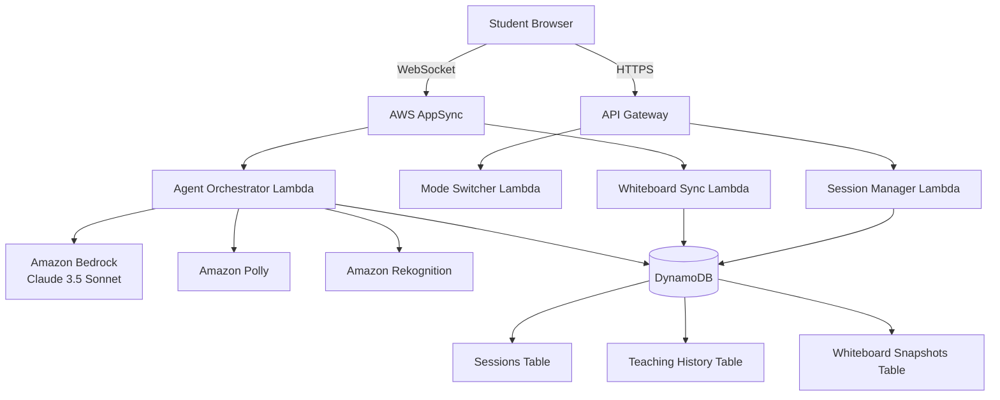

# Design Document: Agent D-I-D Learning Platform

## Overview

Agent D-I-D is a multi-modal AI learning platform that implements the Feynman Technique through dual AI personas. The system architecture leverages AWS services to provide real-time voice and visual interactions between students and two distinct AI agents: Jarvis (confused peer) and Ultron (master teacher).

The platform is built on a serverless architecture using AWS services:
- **Amazon Bedrock** (Claude 3.5 Sonnet) for AI reasoning
- **Amazon Polly** for text-to-speech
- **Amazon Rekognition** for visual understanding
- **AWS AppSync** for real-time synchronization
- **Amazon DynamoDB** for data persistence

## Architecture

### High-Level Architecture



### Component Architecture

The system is organized into the following layers:

1. **Presentation Layer**: Browser-based client with canvas rendering and WebSocket connection
2. **API Layer**: API Gateway for REST endpoints, AppSync for real-time GraphQL subscriptions
3. **Business Logic Layer**: Lambda functions for orchestration, mode management, and session control
4. **AI Services Layer**: AWS AI services (Bedrock, Polly, Rekognition)
5. **Data Layer**: DynamoDB tables for persistence

## Components and Interfaces

### 1. Agent Orchestrator

The Agent Orchestrator is the core component that manages AI persona behavior and coordinates between AWS AI services.

**Responsibilities:**
- Route requests to appropriate AI persona (Jarvis or Ultron)
- Manage prompt engineering for persona consistency
- Coordinate between Bedrock, Polly, and Rekognition
- Handle AI response validation and retry logic

**Interface:**

```typescript
interface AgentOrchestrator {
  // Generate AI response based on current mode and context
  generateResponse(request: AgentRequest): Promise<AgentResponse>
  
  // Process student input (text or visual)
  processStudentInput(input: StudentInput): Promise<ProcessedInput>
  
  // Generate whiteboard drawing instructions
  generateDrawing(concept: string, mode: AgentMode): Promise<DrawingInstructions>
}

interface AgentRequest {
  sessionId: string
  mode: AgentMode  // 'JARVIS' | 'ULTRON'
  studentInput: ProcessedInput
  whiteboardContext: WhiteboardSnapshot
  conversationHistory: Message[]
}

interface AgentResponse {
  text: string
  audioUrl: string  // S3 URL to Polly-generated audio
  drawingInstructions?: DrawingInstructions
  suggestedModeSwitch?: AgentMode
}

interface ProcessedInput {
  text?: string
  visualFeatures?: VisualFeatures
  intent: StudentIntent  // 'EXPLAIN' | 'QUESTION' | 'CORRECTION' | 'REQUEST_HELP'
}

type AgentMode = 'JARVIS' | 'ULTRON'
```

### 2. Persona Prompt Manager

Manages prompt templates and configurations for each AI persona to ensure consistent behavior.

**Responsibilities:**
- Maintain prompt templates for Jarvis and Ultron
- Inject session context into prompts
- Ensure persona-specific behavior constraints

**Interface:**

```typescript
interface PersonaPromptManager {
  // Build complete prompt for Bedrock API
  buildPrompt(mode: AgentMode, context: PromptContext): string
  
  // Validate response aligns with persona
  validatePersonaAlignment(mode: AgentMode, response: string): boolean
}

interface PromptContext {
  topic: string
  conversationHistory: Message[]
  whiteboardDescription: string
  studentLevel: string  // inferred from teaching history
  recentCorrections: Correction[]
}

// Jarvis Prompt Template Structure:
// - Role: Confused peer who needs teaching
// - Behavior: Ask questions, make intentional mistakes, express confusion
// - Constraints: Max 200 words, must ask follow-up questions
// - Error injection: Randomly introduce conceptual errors for student correction

// Ultron Prompt Template Structure:
// - Role: Master teacher with deep expertise
// - Behavior: Provide clear explanations, draw precise diagrams, explain reasoning
// - Constraints: Max 200 words, must include visual description
// - Quality: Ensure accuracy and comprehensiveness
```

### 3. Whiteboard Manager

Manages the digital whiteboard state, rendering, and synchronization.

**Responsibilities:**
- Track whiteboard state (strokes, shapes, text)
- Synchronize drawing operations in real-time
- Generate drawing instructions for AI agents
- Capture and store whiteboard snapshots

**Interface:**

```typescript
interface WhiteboardManager {
  // Add drawing operation to whiteboard
  addOperation(sessionId: string, operation: DrawingOperation): Promise<void>
  
  // Get current whiteboard state
  getState(sessionId: string): Promise<WhiteboardState>
  
  // Clear whiteboard (with confirmation)
  clear(sessionId: string): Promise<void>
  
  // Save snapshot with label
  saveSnapshot(sessionId: string, label: string): Promise<string>
  
  // Load previous snapshot
  loadSnapshot(snapshotId: string): Promise<WhiteboardState>
  
  // Generate image for Rekognition analysis
  generateImage(sessionId: string): Promise<Buffer>
}

interface DrawingOperation {
  type: 'STROKE' | 'SHAPE' | 'TEXT' | 'ERASE' | 'CLEAR'
  timestamp: number
  author: 'STUDENT' | 'JARVIS' | 'ULTRON'
  data: StrokeData | ShapeData | TextData | EraseData
}

interface WhiteboardState {
  sessionId: string
  operations: DrawingOperation[]
  lastModified: number
  thumbnail?: string  // Base64 encoded preview
}

interface DrawingInstructions {
  operations: DrawingOperation[]
  narration: string[]  // Text to speak while drawing
  duration: number  // Expected drawing duration in ms
}
```

### 4. Visual Recognition Service

Wraps Amazon Rekognition to analyze whiteboard content and extract meaningful features.

**Responsibilities:**
- Analyze whiteboard images for visual features
- Detect shapes, text, and spatial relationships
- Provide context to AI agents about visual content

**Interface:**

```typescript
interface VisualRecognitionService {
  // Analyze whiteboard image
  analyzeWhiteboard(image: Buffer): Promise<VisualFeatures>
  
  // Detect specific concept visualization
  detectConcept(image: Buffer, expectedConcept: string): Promise<ConceptMatch>
}

interface VisualFeatures {
  detectedText: string[]
  shapes: DetectedShape[]
  labels: string[]  // High-level concepts detected
  confidence: number
  spatialLayout: SpatialRelationship[]
}

interface DetectedShape {
  type: 'LINE' | 'CIRCLE' | 'RECTANGLE' | 'ARROW' | 'CURVE' | 'UNKNOWN'
  confidence: number
  boundingBox: BoundingBox
  properties: ShapeProperties
}

interface ConceptMatch {
  matches: boolean
  confidence: number
  discrepancies: string[]  // What's wrong or missing
}
```

### 5. Voice Service

Wraps Amazon Polly to generate speech with persona-specific voice profiles.

**Responsibilities:**
- Convert text to speech with appropriate voice
- Apply voice characteristics for each persona
- Manage audio file storage and delivery

**Interface:**

```typescript
interface VoiceService {
  // Generate speech audio
  synthesizeSpeech(text: string, persona: AgentMode): Promise<AudioResult>
  
  // Get voice configuration for persona
  getVoiceConfig(persona: AgentMode): VoiceConfig
}

interface AudioResult {
  audioUrl: string  // S3 URL
  duration: number  // milliseconds
  format: 'mp3' | 'ogg'
}

interface VoiceConfig {
  voiceId: string
  engine: 'standard' | 'neural'
  languageCode: string
  rate: string  // Speaking rate (e.g., 'medium', 'slow')
  pitch: string  // Voice pitch adjustment
  volume: string  // Volume adjustment
}

// Jarvis Voice Config:
// - VoiceId: 'Matthew' or 'Joey' (hesitant, curious tone)
// - Rate: 'medium' with occasional pauses
// - Pitch: Slightly higher to convey uncertainty

// Ultron Voice Config:
// - VoiceId: 'Brian' or 'Russell' (confident, authoritative)
// - Rate: 'medium' with steady pacing
// - Pitch: Lower to convey authority
```

### 6. Session Manager

Manages learning session lifecycle, state, and persistence.

**Responsibilities:**
- Create, pause, resume, and end sessions
- Track session metadata and progress
- Coordinate session state persistence

**Interface:**

```typescript
interface SessionManager {
  // Create new learning session
  createSession(studentId: string, topic: string): Promise<Session>
  
  // Get active session
  getSession(sessionId: string): Promise<Session>
  
  // Update session state
  updateSession(sessionId: string, updates: Partial<Session>): Promise<void>
  
  // Pause session (save state)
  pauseSession(sessionId: string): Promise<void>
  
  // Resume paused session
  resumeSession(sessionId: string): Promise<Session>
  
  // End session and generate summary
  endSession(sessionId: string): Promise<SessionSummary>
  
  // Auto-save session state
  autoSave(sessionId: string): Promise<void>
}

interface Session {
  sessionId: string
  studentId: string
  topic: string
  currentMode: AgentMode
  status: 'ACTIVE' | 'PAUSED' | 'ENDED'
  startTime: number
  lastActivity: number
  interactionCount: number
  conversationHistory: Message[]
  whiteboardSnapshotIds: string[]
  metadata: SessionMetadata
}

interface SessionSummary {
  sessionId: string
  duration: number
  interactionCount: number
  modesUsed: { JARVIS: number, ULTRON: number }
  conceptsCovered: string[]
  keyMoments: KeyMoment[]
}
```

### 7. Mode Switcher

Handles transitions between Jarvis and Ultron modes.

**Responsibilities:**
- Validate mode switch requests
- Enforce rate limiting on mode switches
- Preserve context during transitions
- Coordinate handoff between personas

**Interface:**

```typescript
interface ModeSwitcher {
  // Switch to different mode
  switchMode(sessionId: string, targetMode: AgentMode): Promise<ModeSwitchResult>
  
  // Check if mode switch is allowed
  canSwitchMode(sessionId: string): Promise<boolean>
  
  // Get time until next switch allowed
  getTimeUntilNextSwitch(sessionId: string): Promise<number>
}

interface ModeSwitchResult {
  success: boolean
  newMode: AgentMode
  transitionMessage: string
  error?: string
}

// Mode Switch Rules:
// - Minimum 30 seconds between switches
// - Preserve whiteboard content
// - Allow new persona to reference previous context
// - Generate transition message explaining handoff
```

### 8. Teaching History Tracker

Tracks and analyzes student's teaching interactions with Jarvis over time.

**Responsibilities:**
- Record teaching interactions
- Analyze teaching patterns and progress
- Provide insights for persona adaptation

**Interface:**

```typescript
interface TeachingHistoryTracker {
  // Record teaching interaction
  recordInteraction(interaction: TeachingInteraction): Promise<void>
  
  // Get student's teaching history
  getHistory(studentId: string, limit?: number): Promise<TeachingHistory>
  
  // Analyze teaching effectiveness
  analyzeProgress(studentId: string): Promise<ProgressAnalysis>
}

interface TeachingInteraction {
  sessionId: string
  studentId: string
  timestamp: number
  concept: string
  studentExplanation: string
  jarvisQuestion: string
  correctionsMade: Correction[]
  effectiveness: number  // 0-1 score
}

interface TeachingHistory {
  studentId: string
  interactions: TeachingInteraction[]
  totalSessions: number
  conceptsMastered: string[]
  averageEffectiveness: number
}

interface ProgressAnalysis {
  studentLevel: 'BEGINNER' | 'INTERMEDIATE' | 'ADVANCED'
  strengths: string[]
  areasForImprovement: string[]
  recommendedTopics: string[]
}
```

### 9. Real-Time Sync Service

Manages WebSocket connections and real-time data synchronization via AWS AppSync.

**Responsibilities:**
- Maintain WebSocket connections
- Broadcast drawing operations
- Handle connection quality monitoring
- Manage reconnection logic

**Interface:**

```typescript
interface RealTimeSyncService {
  // Broadcast operation to all session participants
  broadcast(sessionId: string, operation: SyncOperation): Promise<void>
  
  // Subscribe to session updates
  subscribe(sessionId: string, connectionId: string): Promise<Subscription>
  
  // Check connection quality
  getConnectionQuality(connectionId: string): Promise<ConnectionQuality>
  
  // Handle disconnection
  handleDisconnect(connectionId: string): Promise<void>
}

interface SyncOperation {
  type: 'DRAWING' | 'MODE_SWITCH' | 'MESSAGE' | 'STATE_UPDATE'
  timestamp: number
  data: any
  sequenceNumber: number
}

interface ConnectionQuality {
  latency: number  // milliseconds
  status: 'EXCELLENT' | 'GOOD' | 'POOR' | 'DISCONNECTED'
  lastPing: number
}

// Sync Requirements:
// - Drawing operations synced within 100ms
// - Maintain operation ordering via sequence numbers
// - Display quality indicator when latency > 500ms
// - Auto-reconnect with exponential backoff
```

## Data Models

### DynamoDB Tables

#### Sessions Table

```typescript
interface SessionRecord {
  // Partition Key
  sessionId: string
  
  // Attributes
  studentId: string
  topic: string
  currentMode: AgentMode
  status: 'ACTIVE' | 'PAUSED' | 'ENDED'
  startTime: number
  endTime?: number
  lastActivity: number
  interactionCount: number
  conversationHistory: Message[]
  whiteboardSnapshotIds: string[]
  metadata: SessionMetadata
  
  // GSI: studentId-startTime-index
  // For querying all sessions by student
}

interface Message {
  timestamp: number
  author: 'STUDENT' | 'JARVIS' | 'ULTRON'
  text: string
  audioUrl?: string
  intent?: StudentIntent
}

interface SessionMetadata {
  modesUsed: { JARVIS: number, ULTRON: number }
  conceptsCovered: string[]
  lastModeSwitchTime: number
  autoSaveVersion: number
}
```

#### Teaching History Table

```typescript
interface TeachingHistoryRecord {
  // Partition Key
  studentId: string
  
  // Sort Key
  timestamp: number
  
  // Attributes
  sessionId: string
  concept: string
  studentExplanation: string
  jarvisQuestion: string
  correctionsMade: Correction[]
  effectiveness: number
  whiteboardSnapshotId?: string
  
  // GSI: studentId-concept-index
  // For querying teaching history by concept
}

interface Correction {
  timestamp: number
  incorrectStatement: string
  correction: string
  category: 'CONCEPTUAL' | 'PROCEDURAL' | 'FACTUAL'
}
```

#### Whiteboard Snapshots Table

```typescript
interface WhiteboardSnapshotRecord {
  // Partition Key
  snapshotId: string
  
  // Attributes
  sessionId: string
  studentId: string
  label: string
  timestamp: number
  operations: DrawingOperation[]
  imageUrl: string  // S3 URL to rendered image
  thumbnail: string  // Base64 encoded small preview
  visualFeatures?: VisualFeatures
  
  // GSI: sessionId-timestamp-index
  // For querying snapshots by session
}
```

#### Student Profiles Table

```typescript
interface StudentProfileRecord {
  // Partition Key
  studentId: string
  
  // Attributes
  email: string
  name: string
  createdAt: number
  lastActive: number
  totalSessions: number
  totalInteractions: number
  conceptsMastered: string[]
  currentLevel: 'BEGINNER' | 'INTERMEDIATE' | 'ADVANCED'
  preferences: StudentPreferences
}

interface StudentPreferences {
  defaultMode: AgentMode
  voiceEnabled: boolean
  autoSaveInterval: number  // seconds
}
```

## Correctness Properties

*A property is a characteristic or behavior that should hold true across all valid executions of a system—essentially, a formal statement about what the system should do. Properties serve as the bridge between human-readable specifications and machine-verifiable correctness guarantees.*

